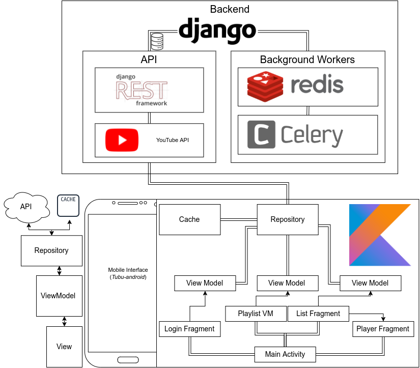

# What's **TUBU**
I've gotten sick from YouTube deleting videos from my saved playlists. Music that I love. Videos I'm attached to. And finally, THE MEMES THAT KEEP GETTING NUKED OFF OF THE PLATFORM! That's it YouTube, _you've crossed the line._

## The solution
I went full ape mode. The idea was to have a service running in the background that **archives** my playlists. That service would then track newly added videos so that minimal interaction is required.

## The app
The workload was split between me and a friend of mine, **[Mohammad Salman](https://github.com/muhammed9865/)**. Thanks to that mad lad and his hard work, he created the Mobile interface **[Tubu-android](https://github.com/muhammed9865/Tubu-android)** -from which the user can interact with the backend- in just one day. I created the backend.

This is essentially just an MVP. The core features and the _**core features only**_. Here's what the architecture looks like:

- The Mobile interface interacts with the API.
- The backend calls YouTube API when needed.
- Background workers periodically archive the playlists.